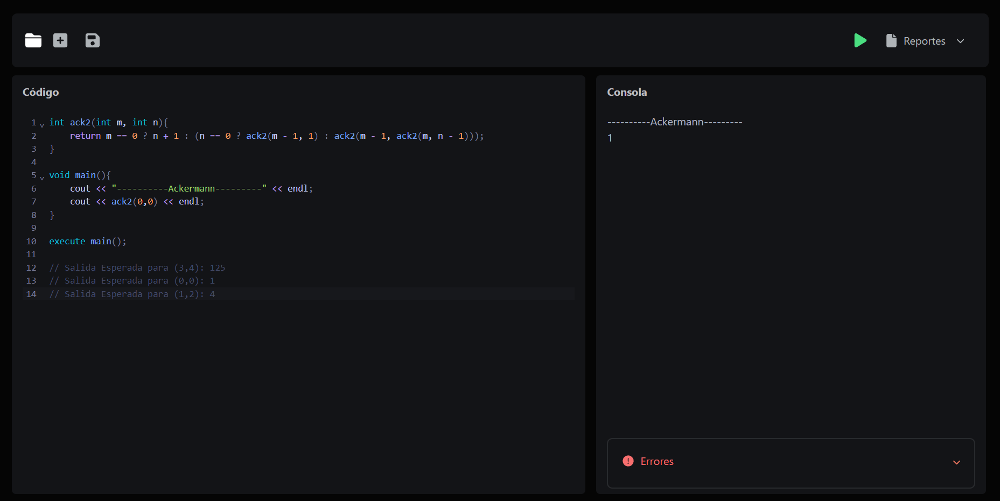
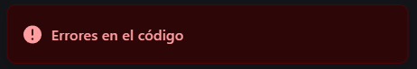
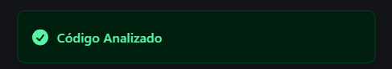
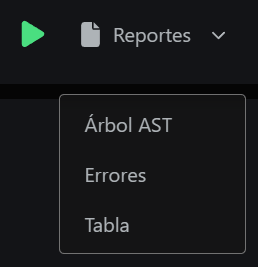
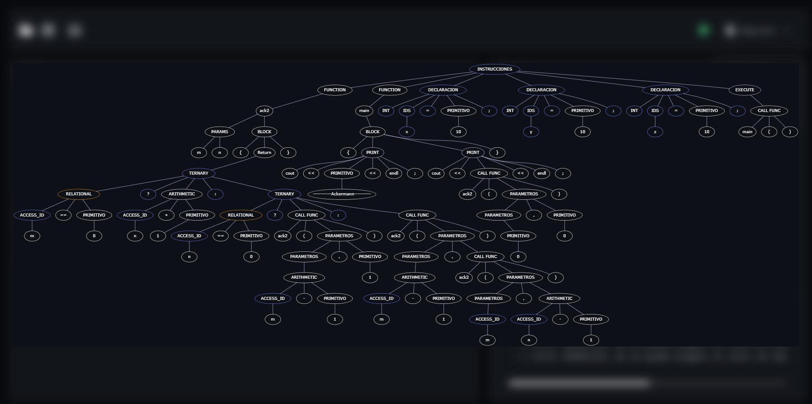
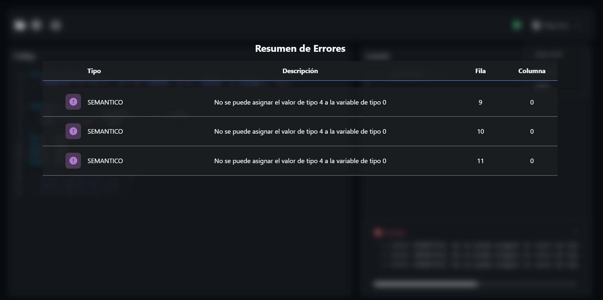
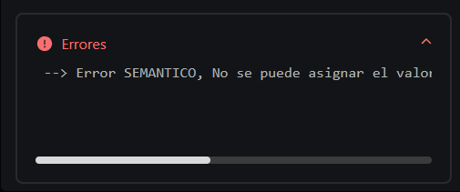
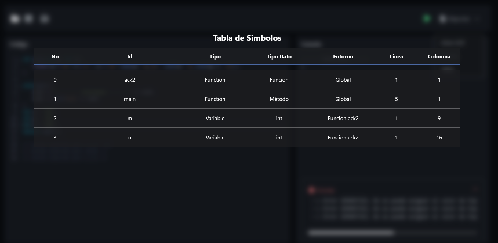

<h1 align="center">Proyecto 1</h1>

<p align="center"></p>

<div align="center">
🙍‍♂️ Joab Israel Ajsivinac Ajsivinac 🆔 202200135
</div>
<div align="center">
📕 Organización de Lenguajes y Compiladores 1
</div>
<div align="center"> 🏛 Universidad San Carlos de Guatemala</div>
<div align="center"> 📆 Primer Semestre 2024</div>


# ⚽ Objetivos
* **Objetivo General**
    *Aplicar los conocimientos sobre la fase de análisis léxico y sintáctico de un compilador para la construcción de una solución de software
* **Objetivos Específicos**.
    * Aprender a genera analizadores léxicos y sintácticos utilizando Jison
    * aprender los conceptos de token, lexema, patrones y
expresiones regulares.
    * realizar correctamente el manejo de errores
léxicos, sintacticso y semanticos.
    * realizar acciones gramaticales
utilizando Typescript.

<br/> 

<h1 align="center">📍 Manual de Usuario</h1>


## ⚒ Requerimientos
<ul>
<li>Sistemas Opreativos</li>
    <ul>
        <li>Windows 8 o Superior</li>
        <li>macOS Catalina o Superior</li>
        <li>Linux: Ubuntu, Debian, CentOS, Fedora, etc.</li>
    </ul>
    <li>Librerias Backend</li>
   <ul>
        <li>cors</li>
        <li>express</li>
        <li>jison</li>
    </ul>
<li>Librerias Frontend</li>
   <ul>
        <li>CodeMirror</li>
        <li>Graphviz-react</li>
        <li>Sonner</li>
        <li>react-icons</li>
        <li>react-doom</li>
    </ul>
</ul>


## 📟 Instalación
Descargue el código o bien clone el repositorio en una carpeta.

Si se opta por la clonación se hace con la siguiente linea de código en terminal (Antes de ejecutar el codigo asegurese de estar en la carpeta donde lo quiere descargar)

```bash
git clone https://github.com/J-Ajsivinac/OLC1_Proyecto2_202200135
```

## ⚡ Inicio Rápido
Una vez teniendo el programa, abra la terminal estando en la carpeta backedn para ejecutar el comando

```
nodemon exec
```

y en la carpeta frontend (sin dejar de ejecutar el backend) ejecute:

```
npm run dev
```


## 💻 Interfaz de Usuario y Funcionalidades
Al abrir el frontend, se podra ver la ventana principal

<p align="center">
    <a href="#"></a>
</p>


En esta parte derecha se puede agregar el codigo ha analizar, y en la parte izquierda se podra visualizar las impresiones en consola generadas por el codigo escrito previamente analizado.


-----

### Ejecución
Al presionar el boton de ejecutar, tendra dos posibles resultados en pantalla, uno cuando el codigo no tiene errores y otro cuando si tiene errores

<p align="center">
    <a href="#"></a>
</p>

<p align="center">
    <a href="#"></a>
</p>

Esto con el fin de dar una ayuda visual a lo que ha sucedido con el analisis

Para que el programa ejecute correctamente se debe llamar a una funcion con execute [Nombre de la funcion]

De esta forma se ejecuta esa funcion como principal

### Sintaxis

* Declaración de Variables
```java
//Comentarios de una linea
type id = value;
type id[] = value;
type id[][] = value;
```
* Declaración de Métodos y Funciones
```java
type id(type param1,type param2 ... type paramN) {
    //instrucciones
    return expresion;
}
void id(type param1,type param2 ... type paramN) {
    //instrucciones
}
type id() {
    //instrucciones
    return expresion;
}
void id() {
    //instrucciones
}
```
* Ciclos
```java
for(declarar variable; condición; actualización de variable) {
    //instrucciones
}
while(condición) {
    //instrucciones
}
do {
    //instrucciones
}while(condición);
```
* Estructuras de Control
```java

if(condicion) {
    if(condicion) { 
        if(condicion) {
    //instrucciones           
    //instrucciones             
        } 
    }
 }
else if(condicion) {        
    //instrucciones
}
...
else {
    //instrucciones
}

//switch
switch(expresion) {
    case expresion:
        //instrucciones
    case expresion:
    case expresion:
    ...
    case expresion:
        //instrucciones
    default:
        //instrucciones
}
```
* Operador Ternario
```java
type id = condicion ? expresion True : expresion False;
```
* Casteo
```java
type id = (type) expresion;
```


### Reportes

Como se indico anteriormente el programa cuenta con la capacidad de realizar reportes que se visualizan en la misma pagina. Desplegando el menu, se podra seleccioanr el tipo de reporte a visualizar (se abrirá en la misma ventana)

<p align="center">
    <a href="#"></a>
</p>


**Ast**

<p align="center">
    <a href="#"></a>
</p>

**Errores**

<p align="center">
    <a href="#"></a>
</p>

A su vez los errores se mostrarán en la parte inferior de la consola, en un apartado diferente denominado errores

<p align="center">
    <a href="#"></a>
</p>


**Tabla de Simbolos**

<p align="center">
    <a href="#"></a>
</p>

